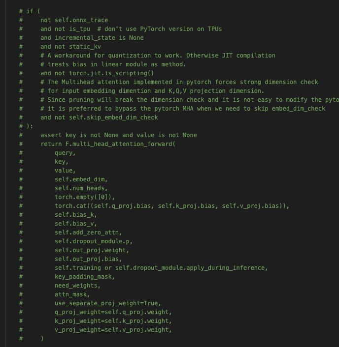

# ALTI+

This repository includes the code from the paper [Ferrando et al., 2022](https://arxiv.org/abs/2205.11631).

We extend ALTI method presented in [Ferrando et al., 2022](https://arxiv.org/abs/2203.04212) to the encoder-decoder setting.

## Abstract
<em>
In Neural Machine Translation (NMT), each token prediction is conditioned on the source sentence and the target prefix (what has been previously translated at a decoding step). However, previous work on interpretability in NMT has focused solely on source sentence tokens attributions. Therefore, we lack a full understanding of the influences of every input token (source sentence and target prefix) in the model predictions. In this work, we propose an interpretability method that tracks complete input token attributions. Our method, which can be extended to any encoder-decoder Transformer-based model, allows us to better comprehend the inner workings of current NMT models. We apply the proposed method to both bilingual and multilingual Transformers and present insights into their behaviour.
</em>

<p align="center"><br>

</p><br>

## Environment Setup

Create a conda environment using the `environment.yml` file, and activate it:

```bash
conda env create -f ./environment.yml && \
conda activate alti_plus
```
Install PyTorch:
```bash
pip install torch==1.10.1+cu113 torchvision==0.11.2+cu113 torchaudio==0.10.1+cu113 -f https://download.pytorch.org/whl/cu113/torch_stable.html
```
Install [Fairseq](https://github.com/facebookresearch/fairseq):
```bash
git clone https://github.com/facebookresearch/fairseq.git
cd fairseq
pip install --editable .
python setup.py build_ext --inplace
```

Install [sacrebleu](https://github.com/mjpost/sacrebleu):
```bash
git clone https://github.com/mjpost/sacrebleu.git
cd sacrebleu
pip install --editable .
```

## Usage with M2M model

Follow fairseq [M2M](https://github.com/pytorch/fairseq/tree/main/examples/m2m_100) instructions and download the models (412M and 1.2B), dictionary, and SPM tokenizer in `M2M_CKPT_DIR`. Then, set the environmental variable:

```bash
export M2M_CKPT_DIR=...
````

`m2m_interpretability.ipynb` can be run in generate or interactive mode. To use it in interactive mode, tokenize your own test data and select `data_sample = 'interactive'` in `m2m_interpretability.ipynb`.

Already tokenized data for a set of languages in [FLORES-101](https://github.com/facebookresearch/flores/blob/main/flores200/README.md), and [De-En Gold Alignment](https://www-i6.informatik.rwth-aachen.de/goldAlignment/) can be found in `./data` for testing the notebook.

You can select to evaluate interpretations using teacher forcing or free decoding/beam search by setting `teacher_forcing` variable in the notebook.

To use the notebook in generate mode, provide the path to the binarized data after running `fairseq-preprocess` and select `data_sample = 'generate'` in `m2m_interpretability.ipynb`.

*Since the method needs to access the activations of keys, queries, and values from the attention mechanism, we need to make fairseq avoid using PyTorch's attention implementation (F.multi_head_attention_forward) by commenting this part of the code in `fairseq/fairseq/modules/multihead_attention.py`:

<p align="center"><br>

</p><br>

### Adding new languages
Using FLORES-101 as an example (in case you want to try other languages), create the environmental variable where to store the dataset:

```bash
export M2M_DATA_DIR=...
```

Download the dataset:
```bash
cd $M2M_DATA_DIR
wget https://dl.fbaipublicfiles.com/flores101/dataset/flores101_dataset.tar.gz
tar -xf flores101_dataset.tar.gz
```
Then, specify the `TRG_LANG_CODE` language and run:
```bash
TRG_LANG_CODE=spa

python path_to_fairseq/fairseq/scripts/spm_encode.py \
    --model $M2M_CKPT_DIR/spm.128k.model \
    --output_format=piece \
    --inputs=$M2M_DATA_DIR/flores101_dataset/devtest/${TRG_LANG_CODE}.devtest \
    --outputs=./data/flores/test.spm.${TRG_LANG_CODE}

cp $M2M_DATA_DIR/flores101_dataset/devtest/${TRG_LANG_CODE}.devtest ./data/flores/test.${TRG_LANG_CODE}
```

## Citation
If you use ALTI+ in your work, please consider citing:
```bibtex
@misc{alti_plus,
    title = {Towards Opening the Black Box of Neural Machine Translation: Source and Target Interpretations of the Transformer},
    author = {Ferrando, Javier and Gállego, Gerard I. and Alastruey, Belen and Escolano, Carlos and Costa-jussà, Marta R.},
    doi = {10.48550/ARXIV.2205.11631},
    url = {https://arxiv.org/abs/2205.11631},
    keywords = {Computation and Language (cs.CL), FOS: Computer and information sciences, FOS: Computer and information sciences},
    publisher = {arXiv},
    year = {2022},
    copyright = {arXiv.org perpetual, non-exclusive license}
}
```